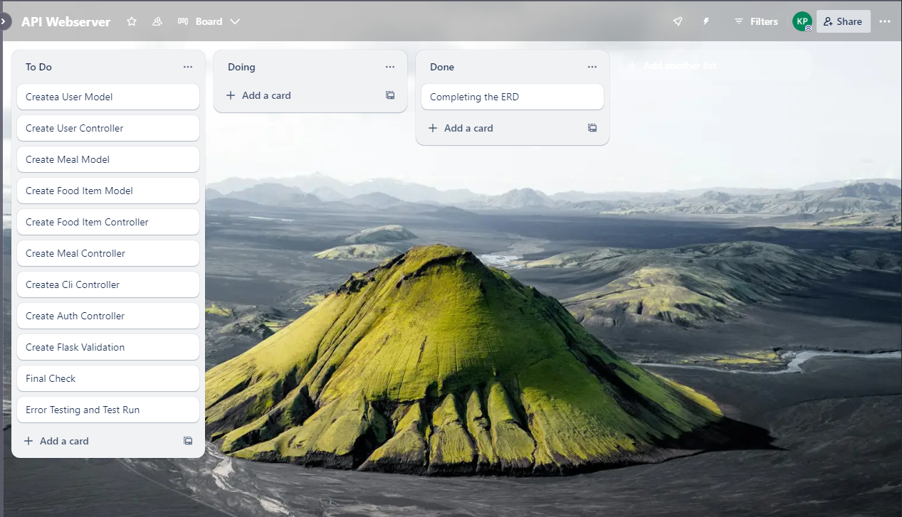
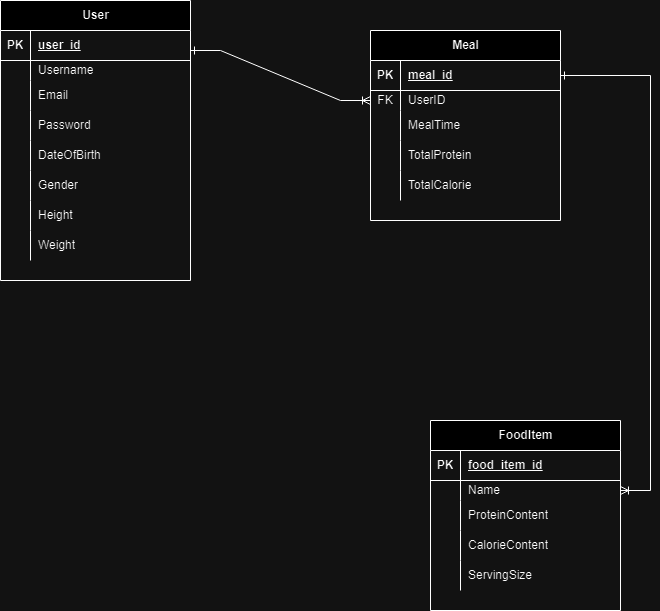

# T2A2 - Protein & Calorie Tracker API - Kevin Phuong

---

## How to use

1. Clone the API to your machine from the Github repo
2. Open the 'src' folder in your terminal
3. Run 'python3 -m venv .venv'
4. Run 'source venv/bin/activate'
5. Run 'pip3 install -r requirements.txt' to install the required python libraries

---

## Explain the problem that this app will solve, and explain how this app solves or addresses this problem.

This API application is meant to give users the ability to keep track of the amount of protein and calories that they intake per meal per food item in the meal. There are many protein trackers that are available to use that track protein however there are not many that can track both calories and protein for each meal per item. 

This application is meant to be used so that users have a lot of free rein in which they wish to track whether that is one full meal or individual pieces of food items in their meal. For example, users can track 1 banana that is present in their home made smoothie and how many calories it provides in comparison to the rest of your meal to be able to know whether to readjust the amount of bananas needed or not needed anymore.

---

## Describe the way tasks are allocated and tracked in your project. 

During the development of this project, I used Trello to help me with keeping track of when tasks needed to be started on and when they needed to be done. My Trello tracker was organised into three tabs:
- To do
- Doing
- Done

Though it was not very descriptive, the simplicity of this tracker allowed me to follow along and enabled me to track which task needed to be done and when and when to start other task.

At the start there were many things to do but the first thing that had to be done before I could start coding was to finish my ERD and have this approved ASAP. After the ERD was approved the coding could begin and it was just a process of following a structure to make sure that everything that i needed to complete would be done as many things needed to be done before I could complete something else. This tracker was important in making sure i had all the necessary parts done before i moved onto the next part. 

---

## List and explain the third party services, packages and dependencies used in this app 

### SQLAlchemy

SQLAlchemy is a Python SQL toolkit and object relational mapping library for Python and is used to help manage databse interactions more efficiently.

### Bcrypt

Bcrypt is a popular library used for hashing passwords in web applications, ensuring secure password storage and is used to help protectusers passwords by converting them into secure hash, which can be stored in database

### Marshmallow

Marshmallow is a library used for object serialisation and deserialisation in Python. It is used to convert complex data types, such as objects, into native Python data types that can be rendered in JSON and vice versa.

### JWTManager

JWTManager is a utility used to manage JSON Web Tokens (JWTs). JWTs are a compact, URL-sage means of represeting claims to be transferred between two parties.

### Flask

Flask is a web framework in Python used to make it easy to build web applications. It provides the essentials needed to make an application up and running while allowing developers to customise it as they so choose.

### Psycopg2

Pyscopg2 is a PostgresSQL adapter for Python that enables interactions between Python and PostgresSQL databases. It allows the server to perform database operations like querying, inserting, updating and deleting records in PostgreSQL databases.

### Dotenv

Dotenv is a Python library that is used to manage environment variables by loading them into '.env' file into the environment.

---

## Explain the benefits and drawbacks of this app's underlying database system

The app's database that was chosen is PostgreSQL or Postgres. Using Postgres as the database for my API webserver offers many benefits some of which include:

**Extensibility** - postgres is highly extensible making it super easy to add extra features yourself. What that allows users to do is to come up with functions, data types, languages, all manner of different changes and that can be all installed into the database server just by saying create extension and postgres completes the rest. 

**Security Features** - postgres has inbuilt security, however, it also has extra extensions that allow users to further enhance its security. Postgres provides users with not only parameter security but also app security, meaning if users what to lock down the database system, postgres provides the configurations at the OS level to help configure the process of locking down the environment around the database. 

**ACID Complicance** - Postgres is fully ACID(Atomicity, Consistency, Isolation, Durability) compliant, ensuring that there is realiable transaction and data integrity. 

Postgres despite having numerous amounts of benefits for its use also comes with some drawbacks some of which include the following:

**Open Source** - Postgres is an open source database application therefore meaning it is not owned by one company which could lead it to have many issues in being popularised as opposed to other database softwares that have full control and copyright over their products. This in turn leads to having no warranty and no liability or indemnity protection. 

**Slower Performance** - Postgres due to its relational database structure, when finding a query, has to start from the first row and read through the entire table to find the relevant data which can cause it to perform slower when there is a large number of data that is being stored in the row and columns.

---
## Explain the features, purposes and functionalities of the object-relational mapping system (ORM) used in this app.

Object relational mapping or ORM is a way to align database structures. It uses metadata secriptors to create a layer between the progrmaming language and relational database by connecting object oriented program code with the database and simplifying the interaction between relational databases and OOP language. ORM also allows developers to perform various data creating, reading, updating and deleting (CRUD) operations in relational databses without using SQL. 

Benefits of using an ORM allow developers to connect the application with the SQL code without rewriting the code therefore increasing the productivity and speeding up development time. ORM also make it easier to maintain applications over time as it automates the object-to-table and table-to-object conversion and requres less code to do so compared to other SQL and procedures. 

---

## Design an entity relationship diagram (ERD) for this app's databse, and explain how the relations between the diagrammed models will aid the database design.

### User Model

#### Table Name

- User

#### Attributes

- User_id = Integer, Primary key 
- Email = String, Unique & Not Null
- Password = String, Not Null
- DateOfBirth = Integer
- Gender = String
- Height = Float, Not Null
- Weight = Float, Not Null

#### Associations

- One to Many with UserID: A user has many meals, meal belongs to one user

#### Table Name

- Meal

#### Attributes

- Meal_id = Integer, Primary Key
- UserID = Integer, Foreign Key & Not Null
- MealTime = Date (date when meal was eaten) 
- TotalProtein = Float
- Total Calories = Float

#### Associations 

- One to Many with MealID: A meal has many meal items, a meal item belongs to one meal

#### Table Name

- FoodItem

#### Attributes

- Food_item_id = Integer, Primary Key
- Name = String, Not Null
- Protein Content = Float
- Calorie Content = Float
- Serving Size = Integer

---

## Explain the implemented models and their relationships, including how the relationships aid the database implementation.

### User Model

The user model represents a user in the system. The user model has a relationship with the meals model through a one to many relationship and is connected through the foreign key of 'user_id" in the meals model. This means that for every one user they can have many meals. 

class User(db.Model):
    __tablename__ = "users"

    id = db.Column(db.Integer, primary_key=True)
    username = db.Column(db.String)
    email = db.Column(db.String, nullable=False, unique=True)
    password = db.Column(db.String, nullable = False)
    date_of_birth = db.Column(db.Date)
    gender = db.Column(db.String)
    height = db.Column(db.Float, nullable = False)
    weight = db.Column(db.Float, nullable = False)
    is_admin = db.Column(db.Boolean, default=False)
    
    meals = db.relationship('Meal', back_populates="user")

### Meal Model

The meal model represents a meal stored in the database. It has a direct relationship with both the User model and the Fooditem model. The meals model has a many to one relationship with the user model and a one to many relationship with the fooditem model.

class Meal(db.Model):
    __tablename__ = "meals"

    id = db.Column(db.Integer, primary_key=True)
    meal_name = db.Column(db.String, unique=True)
    meal_time = db.Column(db.Date) # When it was eaten
    total_protein = db.Column(db.Integer, nullable=False)
    total_calorie = db.Column(db.Integer, nullable=False)
    
    user_id = db.Column(db.Integer, db.ForeignKey("users.id"), nullable=False)

    user = db.relationship("User", back_populates="meals")
    food_items = db.relationship("Fooditem", back_populates="meal")

### Fooditem Model

The fooditem model represents one individual food item in a meal. It has a direct relationship with the Meal Model. The Fooditem model has a many to one relationship with the Meal model. 

class Fooditem(db.Model):
    __tablename__ = "fooditems"

    food_item_id = db.Column(db.Integer, primary_key=True)
    name = db.Column(db.String, nullable=False)
    protein_content = db.Column(db.Float, nullable=False)
    calorie_content = db.Column(db.Float, nullable=False)
    serving_size = db.Column(db.Integer)

    meal_id = db.Column(db.Integer, db.ForeignKey("meals.id"), nullable=False)

    meal = db.relationship("Meal", back_populates="food_items")

---

## Explain how to use this application's API endpoints. Each endpoint should be explained, including the following data for each endpoint.

### POST/auth/register

- registers a new user in the application

username - string which includes the username of a new user
email - string which includes the email (cannot be blank)
password - string containing password of user(cannot be blank)
is_admin - boolean containing admin status (false by default)

### POST/auth/login

- login as pre-existing user

username - string which includes username 
password - string which includes user's password which they previosuly registered with
    - if successful, JWT token and admin status is returned
    - if unsuccessful, 401 error is thrown

### PATCH/user/update

- update user information **user must be logged in**

username - update the username of user, if nothing is typed then use previous user
password - update the password of user, if nothing is typed then use previous password
**if no pre-existing user is found, error 404 is thrown**

### DELETE/user/delete

- delete a users information  **user's must be logged in with their token**

finds the user's id from the database
    if user exist then the user is deleted
    if the user does not exist, error 404 is thrown

### GET/meals

- responds with all the meals that are in the table
    if sucessful, all the meals are displayed
    if unsuccessful, error message is thrown

### GET/meal/int:meal_id

- responds with the selected "meal_id" 
    if successful, meal with "meal_id" is displayed
    if unsuccessful, error message 404 is thrown

### POST/meal/create

- create a new meal 

meal name - string containing meal name (needs to be unique)
meal time - date of when meal was eaten 
total protein - the total amount of protein that is present in the meal (cannot be blank)
total calories - the total amount of calories that is present in the meal (cannot be blank)

### DELETE/meal/int:meal_id

- deletes a specifc meal from the table **user's must be logged in to perform this action**

finds the meal from the database
    if successful, meal is deleted from the database 
    if unsucessful, error message 404 is thrown

### PATCH/meal/int:meal_id

- update a pre-existing meal that is in the database

meal name - update the meal name or use previous meal name if nothing is typed
meal time - update the meal time or use previous meal time 
total protein - updates the amount of protein or keep old protein count
total calorie - updates the amount of calories or keep old calorie count

### POST/fooditem/create

- create a new food item

food item name - string containing food item (can't be blank)
protein content - float containing amount of protein in food item (can't be blank)
calorie content - float containing amount of calories in food item (can't be blank)
serving size - integer containing the serving size included of information

### DELETE/fooditem/int:food_items_id

- delete a specific food item with "food_items_id"

find the database for the specific food item
    if successful, delete the selected food item
    if unsuccessful, error message 404 is thrown 

### PATCH/fooditem/int:food_items_id

- update a specific food item with "food_items_id"

food item name - update the food item name or use previous food item name
protein content - update the protein content or use previous protein content
calorie content - update the calorie content or use previous calorie content
serving size - update the serving size or use previous serving size